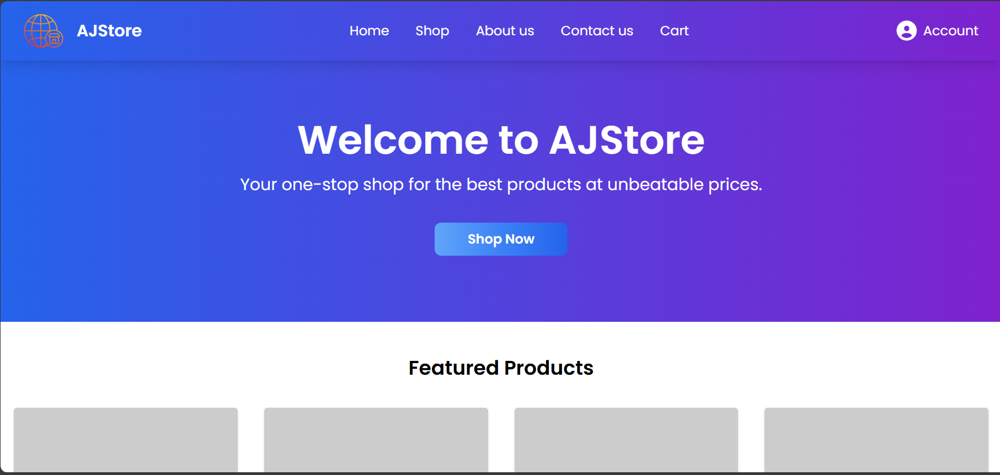
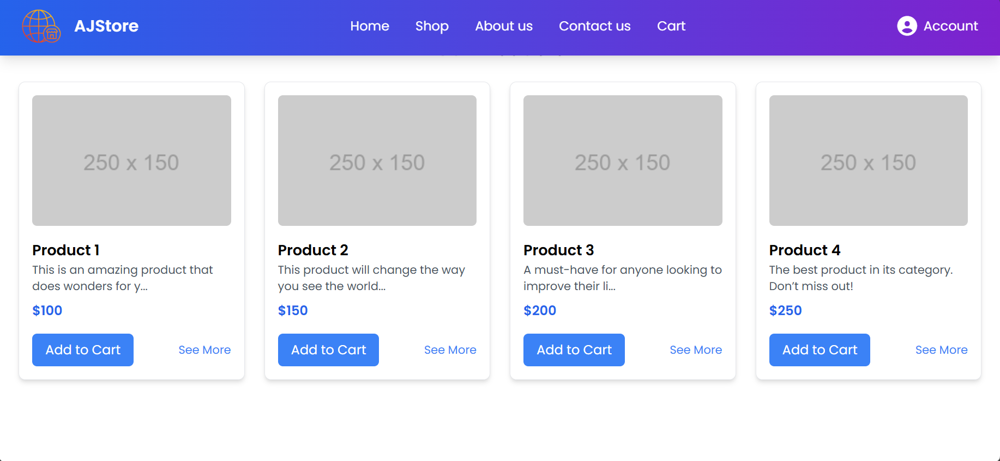
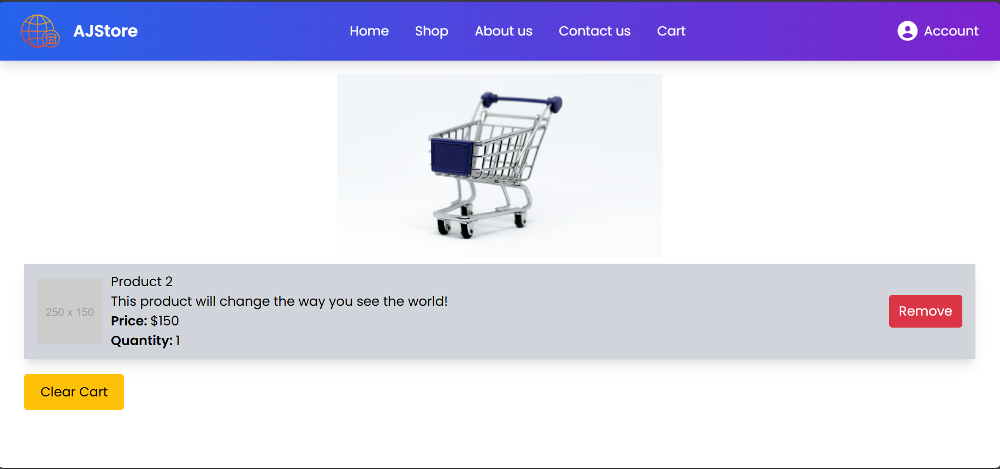
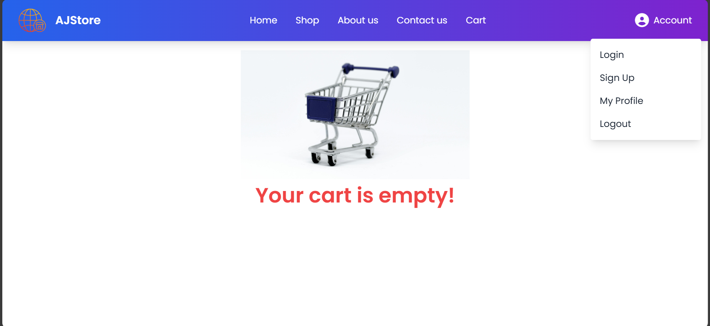
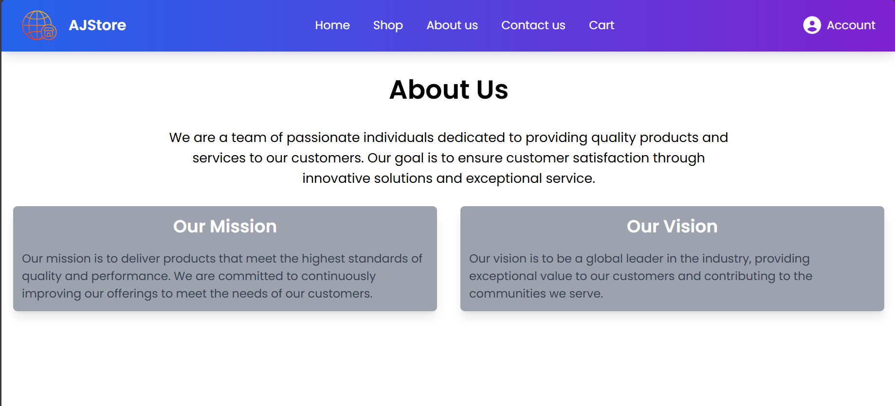
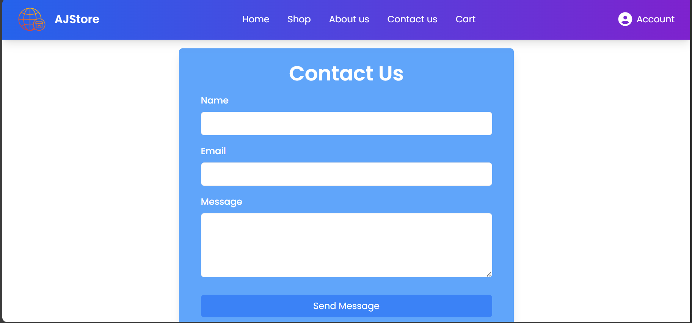
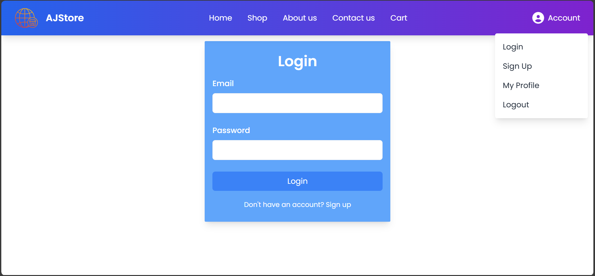
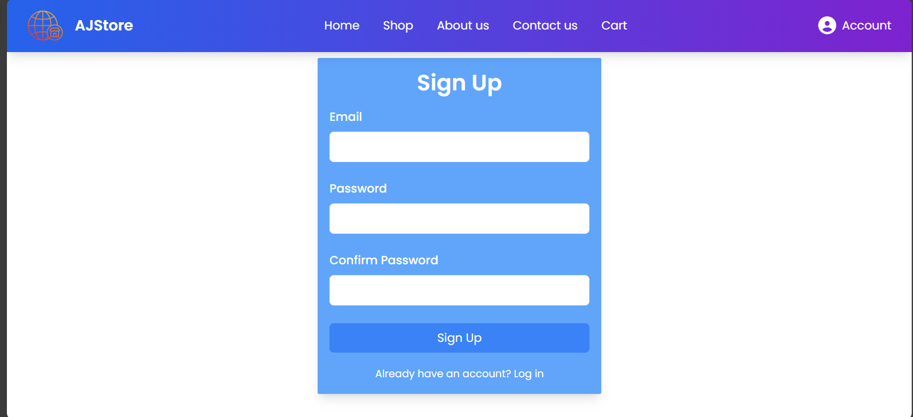
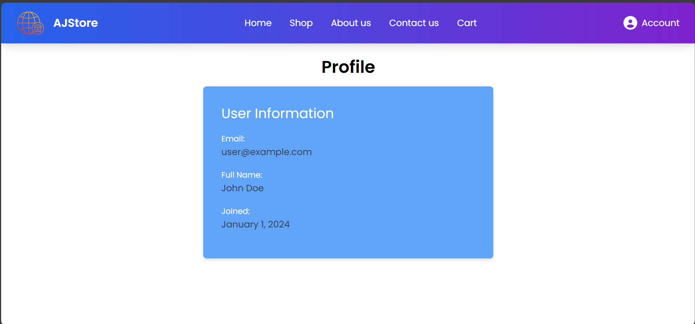

# AJStore - E-commerce Web Application (Frontend)

AJStore is a modern e-commerce platform built using React.js and TailwindCSS. This project provides an intuitive and responsive online shopping experience, focusing on the frontend aspects of the store. It includes essential features like product browsing, user authentication interfaces, shopping cart functionality, and more.

## Screenshots

### Homepage



### Product Catalog



### Shopping Cart



### Empty Cart



### About us



### Contact us



### User Authentication (Login)



### User Authentication (Signup)



### User Profile



**Note**: This project currently focuses on the frontend. The backend and database integration will be added in future updates.

## Features

- **User Authentication Pages**: UI for user login, signup, and profile pages.
- **Product Catalog**: Display products with detailed information, including images, descriptions, and prices.
- **Shopping Cart**: Add, remove, or update items in the shopping cart.
- **Responsive Design**: Fully responsive for desktop, tablet, and mobile devices.
- **Admin Panel (Frontend)**: Interface for managing products, orders, and users (though functionality is not connected to a backend yet).
- **Modern UI**: Clean, modern design built using TailwindCSS.
- **Icons and Graphics**: Uses FontAwesome icons and custom logos.

## Technologies Used

- **Frontend**: React.js, TailwindCSS, FontAwesome
- **State Management**: React hooks and Context API (for managing states like authentication and cart items)
- **Routing**: React Router for navigation
- **Development**: Vite for fast development build and Hot Module Replacement (HMR)

## Getting Started

### Prerequisites

Before running this project, ensure you have the following installed:

- [Node.js](https://nodejs.org/)
- [npm](https://www.npmjs.com/)

### Installation

1. Clone the repository:

```bash
git clone https://github.com/yourusername/ajstore.git
